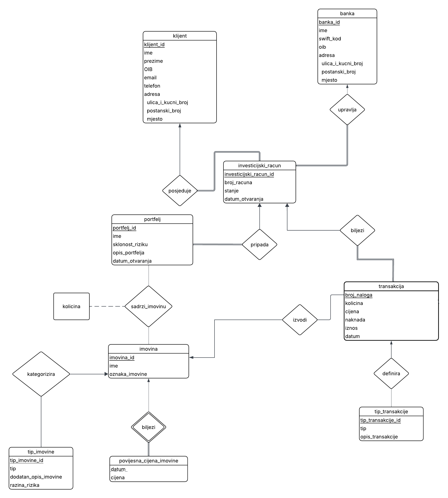
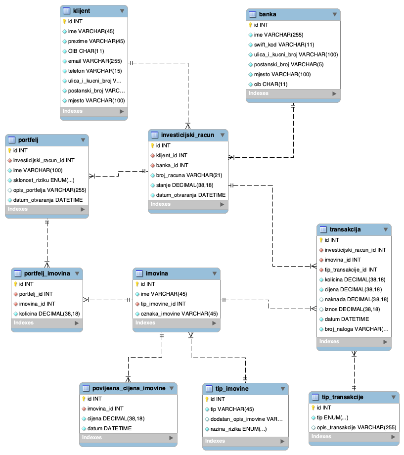

# DOKUMENTACIJA ZA PROJEKTNI ZADATAK "SUSTAV ZA UPRAVLJANJE INVESTICIJSKIM BANKARSTVOM"

## TIM 4

### Studenti: Luka Batarelo, Adrijan Drašćić, Vilibald Kovač, Matteo Lovrić, Benjamin Mihoci

#### 1. OPIS PROJEKTA

Ovaj projekt prošao je kroz nekoliko iteracija — kako su se naše znanje i vještine stečene tijekom semestra nadograđivali, tako smo i sam model baze podataka postupno dorađivali i poboljšavali. Izradili smo bazu podataka pod nazivom „Sustav za upravljanje investicijskim bankarstvom" kojom nastojimo što vjernije, ali i dovoljno pojednostavljeno, opisati poslovni proces investicijskog bankarstva za građane. Sustav je zamišljen kao baza podataka za mobilnu aplikaciju koju svakodnevno koriste mali investitori, odnosno građani.
  
Krajnji cilj je modelirati cjelovit investicijski ciklus: od registracije klijenta (tj. unosa osobnih podataka) i otvaranja investicijskih računa, preko grupiranja ulaganja u portfelje i trgovanja različitim vrstama imovine, do praćenja transakcija i povijesti tržišnih cijena.

Naša je baza tek djelić onoga što bi pravi sustav ove vrste obuhvaćao te smo ju za potrebe projekta morali reducirati i precizno specificirati. Tako se sustav fokusira isključivo na područje Republike Hrvatske i pretpostavlja iznose isključivo u eurima, dok je sam proces registracije te pohrane korisničkog imena i lozinke namjerno izostavljen kako projekt ne bi nepotrebno previše narastao.

Svi podaci kojima smo napunili bazu (imena, OIB-ovi, IBAN-i, nazivi imovine i slično) generirani su nasumično, uz pomoć velikih jezičnih modela, te ne predstavljaju stvarne osobe ni institucije. Konceptualni model prikazan je ER dijagramom, dok je EER dijagram (logička shema) generiran u MySQL Workbenchu, a svaka tablica, ograničenje i upit detaljno su opisani u narednim poglavljima.

#### 1.1 OPIS POSLOVNOG PROCESA

U sustavu se prati proces ulaganja građana u financijske instrumente. Poslovni proces započinje evidencijom klijenta, pri čemu se za svakog klijenta prati ime, prezime, OIB, email, telefon te adresa (ulica i kućni broj, poštanski broj i mjesto), gdje adresa predstavlja **kompozitni atribut**.

Klijent u sustavu otvara jedan ili više investicijskih računa, dok pojedini investicijski račun pripada točno jednom klijentu i točno jednoj banci (kardinalnost **one-to-many** uz **potpunu uključenost** sa strane računa).

Za svaki investicijski račun prati se broj računa (IBAN), stanje i datum otvaranja. Za svaku banku koja upravlja barem jednim računom prati se ime, SWIFT kod, OIB i adresa.

Unutar investicijskog računa klijent kreira jedan ili više portfelja koji služe grupiranju ulaganja. Svaki portfelj pripada točno jednom investicijskom računu (**one-to-many**, **potpuna uključenost**), a za njega se prati ime, sklonost riziku, opis i datum otvaranja.

Portfelj može sadržavati više različitih imovina, a ista imovina može biti dio više portfelja, čime je riječ o vezi tipa **many-to-many (M:N)**. Količina pojedine imovine unutar portfelja modelirana je kao **opisni atribut** te veze. Za svaku imovinu prati se ime, oznaka imovine te tip imovine, pri čemu svaka imovina mora biti klasificirana pod točno jedan tip imovine (**one-to-many**, **potpuna uključenost**). Tip imovine (npr. dionica, fond, obveznica, kriptovaluta...) opisan je vrstom, dodatnim opisom i razinom rizika te predstavlja **pomoćnu (lookup) tablicu**.

Za svaku imovinu sustav vodi povijest cijena kroz vrijeme. Povijesna cijena imovine je **slabi entitet** čije postojanje egzistencijalno ovisi o **jakom entitetu** imovina te se s njime nalazi u identifikacijskoj vezi (**one-to-many** uz **potpunu uključenost**). Njezin **parcijalni ključ** (diskriminator) predstavljen je atributom datum, a uz njega se prati i cijena.

Sve aktivnosti na računu — uplata, isplata, kupnja i prodaja imovine te dividende i naknade — evidentiraju se kroz transakcije. Svaka transakcija veže se za točno jedan investicijski račun (**one-to-many**, **potpuna uključenost**), a za nju se prati količina, cijena, iznos, naknada, datum i broj naloga. Svaka transakcija ima točno jedan tip transakcije (npr. kupovina, prodaja, uplata, isplata ili dividenda), gdje tip transakcije predstavlja **pomoćnu (lookup) tablicu**. Transakcija se može, ali i ne mora odnositi na pojedinu imovinu (**djelomična uključenost**), budući da uplate i isplate ne uključuju nikakvu imovinu, a moguće je i da neka novododana imovina još nije imala nijednu transakciju.

Klasifikacija imovine i transakcija ostvarena je putem zasebnih **pomoćnih (lookup) tablica** (tip_imovine i tip_transakcije), čime se osigurava konzistentnost i proširivost sustava. Na taj način sustav omogućuje cjelovito praćenje investicijskog ciklusa — od unosa klijenta i upravljanja računima, preko ulaganja i transakcija, do analize tržišnih podataka i ostvarivanja prihoda.

#### 1.2 PRIMJER IZ PRAKSE

Kako bi gore opisani poslovni proces bio što zorniji, u nastavku ga pratimo kroz jedan tipičan scenarij korištenja mobilne aplikacije iz perspektive korisnika. Pretpostavimo da Ana Anić, mlada inženjerka iz Pule, želi početi ulagati svoju ušteđevinu.

**1. Registracija (unos klijenta).** Ana preuzima aplikaciju i ispunjava obrazac sa svojim osobnim podacima — imenom, prezimenom, OIB-om, e-mailom, telefonom i adresom stanovanja. Potvrdom obrasca u tablicu **klijent** zapisuje se novi redak s Aninim podacima. (Napomena: sam mehanizam prijave putem korisničkog imena i lozinke namjerno je izostavljen iz opsega projekta — u našem modelu „registracija" znači evidenciju osobnih podataka klijenta.)

**2. Otvaranje investicijskog računa.** Da bi mogla ulagati, Ana unutar aplikacije otvara investicijski račun pri odabranoj banci (npr. Zagrebačka banka). Time nastaje novi redak u tablici **investicijski_racun**, koji preko stranih ključeva povezuje Anu (klijent) i njezinu banku. Račun na početku ima `stanje` od 0,00 € i zabilježeni `datum_otvaranja`. Ana može, ako poželi, otvoriti i dodatne račune kod drugih banaka.

**3. Uplata sredstava.** Ana sa svog tekućeg računa uplaćuje 5.000 € na novootvoreni investicijski račun. Ova se uplata bilježi kao redak u tablici **transakcija** s tipom „uplata" (iz lookup tablice **tip_transakcije**). Budući da uplata ne uključuje nikakvu imovinu, atribut `imovina_id` ostaje `NULL`, dok se `stanje` na investicijskom računu povećava na 5.000 €.

**4. Kreiranje portfelja.** Ana želi razdvojiti svoja ulaganja prema riziku pa kreira dva portfelja unutar svog računa — npr. „Sigurna mirovina" (`sklonost_riziku` = niska) i „Agresivni rast" (`sklonost_riziku` = visoka). Svaki od njih zapisuje se kao redak u tablici **portfelj**, vezan za njezin investicijski račun.

**5. Razmatranje kupnje (uvid u kretanje cijene).** Prije nego što se odluči na kupnju, Ana želi procijeniti isplati li joj se ulaganje. Aplikacija joj zato na zaslonu pojedine imovine prikazuje povijesni graf cijene, koji se gradi iz svih zapisa vezanih uz tu imovinu u tablici **povijesna_cijena_imovine** (svaki redak nosi `cijena` i pripadajući `datum`). Tako Ana može vidjeti kako se cijena dionice Apple kretala kroz vrijeme — je li u uzlaznom ili silaznom trendu, koliko je volatilna te po kojoj se cijeni trenutačno trguje — i na temelju toga donijeti informiranu odluku.

**6. Kupnja imovine.** Uvjerena u svoju odluku, u portfelju „Agresivni rast" Ana kupuje 3 dionice tvrtke Apple (oznaka AAPL). Aplikacija dohvaća aktualnu cijenu imovine iz tablice **imovina** (te njezinu cijenu iz **povijesna_cijena_imovine** - gleda se cijena imovine na datum kupnje) i izvršava kupnju. Pritom se događa nekoliko stvari odjednom:

- u tablicu **transakcija** upisuje se redak s tipom „kupovina", popunjenim atributima `kolicina`, `cijena`, `iznos` i `naknada` te referencom na kupljenu imovinu (`imovina_id`)
- `stanje` na investicijskom računu umanjuje se za ukupan iznos kupnje uvećan za naknadu
- u tablici **portfelj_imovina** evidentira se da portfelj „Agresivni rast" sada sadrži 3 jedinice imovine AAPL (atribut `kolicina`)

Valja istaknuti jednu važnu pojedinost ovog koraka: podatak o tome u **koji** je portfelj imovina kupljena postoji isključivo u aplikaciji (backendu) u trenutku izvršenja kupnje. Tablica **transakcija** veže se za investicijski račun i imovinu, ali **ne** i za pojedini portfelj, dok tablica **portfelj_imovina** bilježi samo trenutno (agregirano) stanje, a ne povijesni slijed naloga. Drugim riječima, na razini same baze moguće je pratiti povijest transakcija po računu i trenutni sastav po portfelju, ali ne i povijesni tok pojedine transakcije unutar konkretnog portfelja. Riječ je o svjesnom ograničenju opsega, o kojem više govorimo u zaključku.

**7. Pregled portfelja.** Kad se Ana kasnije vrati u aplikaciju, na zaslonu „Moji portfelji" vidi pregled svojih ulaganja. Aplikacija u pozadini spaja podatke iz tablica **portfelj**, **portfelj_imovina** i **imovina**, a trenutnu vrijednost svake stavke računa množeći Aninu `kolicinu` s posljednjom poznatom cijenom iz tablice **povijesna_cijena_imovine**. Tako Ana u svakom trenutku vidi koliko koje imovine posjeduje i koliko ona danas vrijedi.

**8. Daljnje aktivnosti.** S vremenom Ana može dokupljivati ili prodavati imovinu (nove transakcije tipa „kupovina"/„prodaja"), primati dividende (transakcija tipa „dividenda" koja povećava `stanje`) ili podići dio sredstava (transakcija tipa „isplata"). Svaka takva aktivnost ostavlja trag u tablici **transakcija**, čime sustav vodi potpunu povijest Aninog investicijskog ciklusa.

Ovaj primjer pokazuje kako naizgled jednostavne korisničke radnje — registracija, uplata, kupnja i pregled portfelja — u pozadini pokreću usklađen niz unosa i izmjena u međusobno povezanim tablicama, što je upravo ono što naš model baze podataka nastoji vjerno opisati.

#### 2. ER dijagram



#### 3. OPIS ER DIJAGRAMA

1. **klijent** i **investicijski_racun** su u vezi tipa **one-to-many (1:M)**. Jedan klijent može posjedovati više investicijskih računa, dok pojedini investicijski račun pripada točno jednom klijentu. Veza je sa strane investicijskog računa **potpuno uključena (totalna participacija)**, što znači da je pri unosu računa obavezno definirati pripadajućeg klijenta. Atribut adresa je kompozitni atribut.
2. **banka** i **investicijski_racun** su u vezi tipa **one-to-many (1:M)**. Jedna banka može upravljati većim brojem investicijskih računa, dok pojedini investicijski račun pripada točno jednoj banci. Veza je sa strane investicijskog računa **potpuno uključena** jer svaki račun mora biti otvoren unutar jedne konkretne banke. Atribut adresa je kompozitni atribut.
3. **investicijski_racun** i **portfelj** su u vezi tipa **one-to-many (1:M)**. Jedan investicijski račun može sadržavati više portfelja, dok pojedini portfelj pripada točno jednom investicijskom računu. Veza je sa strane portfelja **potpuno uključena** jer je portfelj nužno vezan za krovni investicijski račun.
4. **portfelj** i **imovina** su u vezi tipa **many-to-many (M:N)**. Jedan portfelj može sadržavati više različitih imovina, a ista imovina može biti dio više različitih portfelja. Budući da je riječ o **many-to-many** vezi, količina imovine unutar pojedinog portfelja modelirana je kao **opisni atribut** ove veze.
5. **tip_imovine** i **imovina** su u vezi tipa **one-to-many (1:M)**. Jedan tip imovine kategorizira više različitih imovina, dok pojedina imovina pripada točno jednom tipu imovine. Veza je sa strane imovine **potpuno uključena** jer svaka imovina mora biti klasificirana pod jedan definiran tip.
6. **imovina** i **povijesna_cijena_imovine** su u **identifikacijskoj vezi** tipa **one-to-many (1:M)**. Povijesna cijena je prirodno **slabi skup entiteta** čije postojanje egzistencijalno ovisi o jakom skupu entiteta imovina, a njezin parcijalni ključ (**diskriminator**) je predstavljen atributom datum. Slabi entitet podrazumijeva i potpunu uključenost.
7. **tip_transakcije** i **transakcija** su u vezi tipa **one-to-many (1:M)**. Jedan tip transakcije definira vrstu za više različitih transakcija, dok pojedina transakcija ima točno jedan definiran tip. Veza je sa strane transakcije **potpuno uključena** jer svaka transakcija mora imati određenu vrstu (npr. kupovina, prodaja itd.).
8. **imovina** i **transakcija** su u vezi tipa **one-to-many (1:M)**. Nad jednom imovinom može se izvršiti više različitih transakcija, dok se pojedina transakcija odnosi na najviše jednu imovinu. Veza sa strane entiteta transakcija u ovoj vezi je **djelomično uključena** (partial participation), što omogućuje postojanje transakcija (poput uplata i isplata) koje nisu povezane niti s jednom instancom imovine. Veza sa strane imovine je također **djelomično uključena** jer je moguće da neka imovina još uvijek nije imala niti jednu transakciju (npr. nova imovina koja je tek dodana u sustav).
9. **investicijski_racun** i **transakcija** su u vezi tipa **one-to-many (1:M)**. Na jednom investicijskom računu može se izvršiti više transakcija, dok se svaka pojedinačna transakcija veže za točno jedan investicijski račun. Veza je sa strane transakcije **potpuno uključena** jer svaka transakcija mora teretiti ili odobravati točno određeni investicijski račun.

---

#### 4. RELACIJSKI MODEL (sheme)

U fazi relacijskog modeliranja uvodimo surogatne ključeve za sve entitete radi optimizacije performansi i lakše implementacije u SQL-u.
*(Napomena: **Podebljani** atributi su primarni ključevi, a *kosi* atributi su strani ključevi).*

- **klijent** (**klijent_id**, ime, prezime, OIB, email, telefon, ulica_i_kucni_broj, postanski_broj, mjesto)
- **banka** (**banka_id**, ime, swift_kod, ulica_i_kucni_broj, postanski_broj, mjesto, oib)
- **investicijski_racun** (**investicijski_racun_id**, *klijent_id*, *banka_id*, broj_racuna, stanje, datum_otvaranja)
- **portfelj** (**portfelj_id**, *investicijski_racun_id*, ime, sklonost_riziku, opis_portfelja, datum_otvaranja)
- **imovina** (**imovina_id**, ime, *tip_imovine_id*, oznaka_imovine)
- **portfelj_imovina** (**portfelj_imovina_id**, *portfelj_id*, *imovina_id*, kolicina)
- **povijesna_cijena_imovine** (**povijesna_cijena_imovine_id**, *imovina_id*, cijena, datum)
- **tip_imovine** (**tip_imovine_id**, tip, dodatan_opis_imovine, razina_rizika)
- **transakcija** (**transakcija_id**, *investicijski_racun_id*, *imovina_id*, *tip_transakcije_id*, kolicina, cijena, naknada, iznos, datum, broj_naloga)
- **tip_transakcije** (**tip_transakcije_id**, tip, opis_transakcije)

#### 5. EER



#### 6. TABLICE

##### 6.1 TABLICA klijent

``` sql
CREATE TABLE klijent(
  id INT PRIMARY KEY AUTO_INCREMENT,
  ime VARCHAR(45) NOT NULL,
  prezime VARCHAR(45) NOT NULL,
  OIB CHAR(11) NOT NULL UNIQUE,
  email VARCHAR(255) NOT NULL UNIQUE,
  telefon VARCHAR(20) NOT NULL UNIQUE,
  ulica_i_kucni_broj VARCHAR(255) NOT NULL,
  postanski_broj CHAR(5) NOT NULL,
  mjesto VARCHAR(45) NOT NULL,
  CHECK (OIB REGEXP '^[0-9]{11}$'),
  CHECK (postanski_broj REGEXP '^[0-9]{5}$')
);
```

Tablica klijent služi za vođenje evidencije o klijentima koji u našem sustavu posjeduju investicijske račune.

Atribut **id** je PRIMARY KEY tipa INT s obzirom na to da je riječ o brojčanoj vrijednosti. Budući da je riječ o primarnom ključu UNIQUE i NOT NULL nije potrebno navoditi. AUTO_INCREMENT služi automatskom dodavanju jedinstvene brojčane vrijednosti prilikom unošenja novog retka u tablicu.

Atributi **ime** i **prezime** su tipa VARCHAR te ne očekujemo da će biti duži od 45 znakova. Ograničenje NOT NULL služi obveznom unosu tih podataka.

Atribut **OIB** osim što mora biti unesen (NOT NULL), mora biti i jedinstven (UNIQUE). Također, mora sadržavati točno 11 brojčanih znakova, što je zajamčeno CHECK-om i regularnim izrazima te samim tipom CHAR(11). Korištenje tipa INT ne bi imalo smisla zbog mogućih nula na početku broja. Također, OIB je ključ kandidat.

Atributi **email** i **telefon** također moraju biti uneseni i biti jedinstveni. VARCHAR se koristi za telefon iz istog razloga kao i za OIB (vodeće nule), ali i zbog mogućnosti upisivanja znakova poput '+' i '-'.

Atribut **ulica_i_kucni_broj** ne mora biti jedinstven (zbog mogućnosti da dva klijenta žive na istoj adresi) dok za **postanski_broj** CHECK-om ponovo jamčimo da će se raditi o točno pet znamenki.

Atribut **mjesto** mora biti unesen, ali ne mora biti UNIQUE jer se odnosi i na sela (a moguće je da se neka isto zovu).

##### 6.2. TABLICA banka

``` sql
CREATE TABLE banka(
  id INT PRIMARY KEY AUTO_INCREMENT,
  ime VARCHAR(255) NOT NULL UNIQUE,
  swift_kod VARCHAR(11) NOT NULL UNIQUE,
  oib CHAR(11) NOT NULL UNIQUE,
  ulica_i_kucni_broj VARCHAR(100) NOT NULL,
  postanski_broj VARCHAR(5) NOT NULL,
  mjesto VARCHAR(100),
  CHECK (OIB REGEXP '^[0-9]{11}$'),
  CHECK (postanski_broj REGEXP '^[0-9]{5}$'),
  CHECK (CHAR_LENGTH(swift_kod) IN (8, 11))
);
```

Ova tablica sadrži popis svih banaka koje upravljaju barem jednim investicijskim računom u našem sustavu.

Primarni ključ predstavljen je atributom **id**, a **ime** označava službeni naziv institucije koji mora biti unesen (NOT NULL). Budući da je ono jedinstveno (UNIQUE), predstavlja ključ-kandidat.

Atribut **swift_kod** je tipa VARCHAR jer sami swift kod banke može varirati između 8 i 11 znakova. Također, on je UNIQUE jer dvije banke ne bi smjele imati isti swift kod. CHECK-om se osigurava da je isti stvarno duljine između 8 i 11 znakova.

Slično kao i kod klijenta, atribut **oib** osim što mora biti unesen (NOT NULL), mora biti i jedinstven (UNIQUE). Također, mora sadržavati točno 11 brojčanih znakova, što je zajamčeno CHECK-om i regularnim izrazima te samim tipom CHAR(11). Korištenje tipa INT ne bi imalo smisla zbog mogućih nula na početku broja. Također, OIB je ključ kandidat.

Atribut **ulica_i_kucni_broj** ne mora biti jedinstven (zbog teoretske mogućnosti da dvije banke budu registrirane na istoj adresi na primjer u jednoj velikoj poslovnoj zgradi) dok za **postanski_broj** CHECK-om ponovo jamčimo da će se raditi o točno pet znamenki.

Atribut **mjesto** mora biti unesen, ali ne mora biti UNIQUE jer se odnosi i na sela (a moguće je da se neka isto zovu).

##### 6.3 TABLICA investicijski_racun

``` sql
CREATE TABLE investicijski_racun(
  id INT PRIMARY KEY AUTO_INCREMENT,
  klijent_id INT NOT NULL,
  banka_id INT NOT NULL,
  broj_racuna VARCHAR(21) NOT NULL UNIQUE,
  stanje DECIMAL(38,12) NOT NULL DEFAULT 0,
  datum_otvaranja DATETIME NOT NULL,
  FOREIGN KEY (klijent_id) REFERENCES klijent (id) ON DELETE CASCADE,
  FOREIGN KEY (banka_id) REFERENCES banka (id) ON DELETE RESTRICT,
  CHECK (broj_racuna REGEXP '^HR[0-9]{19}$')
);
```

Ova tablica predstavlja svojevrsnu polazišnu točku našeg sustava u kojemu se evidentiraju sredstva koja klijentima stoje na raspolaganju za ulaganje.

Atribut **id** je PRIMARY KEY tipa INT s obzirom na to da je riječ o brojčanoj vrijednosti. Budući da je riječ o primarnom ključu UNIQUE i NOT NULL nije potrebno navoditi. AUTO_INCREMENT služi automatskom dodavanju jedinstvene brojčane vrijednosti prilikom unošenja novog retka u tablicu.

**broj_racuna** se ovdje odnosi na IBAN, a CHECK-om i REGEX-om provjeravamo da počinje dvama slovima HR, nakon kojih slijedi 19 numeričkih znakova. Također, mora biti unesen (NOT NULL) i mora biti jedinstven (UNIQUE), zbog čega predstavlja ključ-kandidat.

**stanje** označava dostupna sredstva na pojedinom računu, a koristi tip podatka DECIMAL (koji je *fixed point* čime se izbjegavaju nepreciznosti *floating pointa* koji nije uputno koristiti za novac) s ukupno 38 znamenki, od kojih je 12 iza decimalne točke (što ostavlja 26 znamenki za cijeli dio iznosa). Dodano je ograničenje NOT NULL uz DEFAULT 0 jer svaki novi račun pri otvaranju inicijalno ima nula sredstava. [Budući da se naš hipotetski sustav odvija u Hrvatskoj i služi hrvatskim klijentima i bankama, pretpostavlja se da je riječ o eurima]

**datum_otvaranja** je tipa DATETIME, mora biti unesen (NOT NULL), a predstavlja datum i vrijeme stvaranja određenog investicijskog računa.

Strani ključevi **klijent_id** i **banka_id**, označeni ključnom riječi FOREIGN KEY, povezuju tablicu s tablicama "klijent" i "banka" preko tamošnjih atributa **id** što je određeno ključnom riječi REFERENCES.

ON DELETE CASCADE kod stranog ključa **klijent_id** jamči da će se prilikom brisanja pojedinog retka iz tablice "klijent", obrisati i odgovarajući retci u ovoj tablici.

ON DELETE RESTRICT kod stranog ključa **banka_id** pak će spriječiti brisanje retka iz tablice "banka" ako još uvijek postoje retci u ovoj tablici povezani s njima, odnosno ako još uvijek postoje računi kojima ta banka upravlja. ON DELETE RESTRICT je također defaultno ponašanje.

##### 6.4 TABLICA portfelj

``` sql
CREATE TABLE portfelj(
  id INT PRIMARY KEY AUTO_INCREMENT,
  investicijski_racun_id INT NOT NULL,
  ime VARCHAR(100) NOT NULL,
  sklonost_riziku ENUM('niska','srednja','visoka') NOT NULL,
  opis_portfelja VARCHAR(255),
  datum_otvaranja DATETIME NOT NULL,
  FOREIGN KEY (investicijski_racun_id) REFERENCES investicijski_racun (id) ON DELETE CASCADE,
  UNIQUE (investicijski_racun_id, ime) 
);
```

Tablica portfelj sadrži investicijske portfelje pojedinog investicijskog računa, a služi grupiranju različitih vrsta imovina. Ideja jest da se klijentima omogući posjedovanje više portfelja s različitim stopama rizika.

Atribut **id** je PRIMARY KEY tipa INT s obzirom na to da je riječ o brojčanoj vrijednosti. Budući da je riječ o primarnom ključu UNIQUE i NOT NULL nije potrebno navoditi. AUTO_INCREMENT služi automatskom dodavanju jedinstvene brojčane vrijednosti prilikom unošenja novog retka u tablicu.

**ime** portfelja mora biti uneseno (NOT NULL). Ne mora biti jedinstveno samo po sebi, ali mora biti jedinstveno unutar jednog investicijskog računa, što je zajamčeno ograničenjem UNIQUE (investicijski_racun_id, ime), pri čemu je **investicijski_racun_id** strani ključ koji tablicu povezuje s tablicom "investicijski_racun".

**investicijski_racun_id** predstavlja strani ključ koji tablicu povezuje s tablicom "investicijski_racun".

**sklonost_riziku** je ENUM vrijednost koja može poprimiti sljedeće vrijednosti: 'niska', 'srednja' ili 'visoka'. S obzirom da klijent može imati više portfelja, za svaki može odrediti sklonost riziku te si pojednostaviti izbor koja imovina treba pripadati u koji portfelj.

**opis_portfelja** je kratak opis čemu služi i koja je poanta pofrtelja. Taj atribut je tipa VARCHAR te je nullable jer ne mora svaki portfelj imati i opis.

**datum_otvaranja** odnosi se na datum stvaranja samog portfelja, a atribut je tipa DATETIME.

Ponovo, ON DELETE CASCADE će obrisati portfelj ako se obrisao investicijski račun kojemu pripada.

##### 6.5 TABLICA tip_imovine

``` sql
CREATE TABLE tip_imovine(
  id INT PRIMARY KEY AUTO_INCREMENT,
  tip VARCHAR(45) NOT NULL UNIQUE,
  dodatan_opis_imovine VARCHAR(255),
  razina_rizika ENUM('nizak', 'srednji', 'visok') NOT NULL
);
```

Ova tablica služi za reprezentaciju različitih vrsta imovine koje mogu biti dio pojedinog portfelja kao što su kriptovalute, dionice, itd.

Atribut **id** je PRIMARY KEY tipa INT s obzirom na to da je riječ o brojčanoj vrijednosti. Budući da je riječ o primarnom ključu UNIQUE i NOT NULL nije potrebno navoditi. AUTO_INCREMENT služi automatskom dodavanju jedinstvene brojčane vrijednosti prilikom unošenja novog retka u tablicu.

Atribut **tip** označava vrstu određene imovine te je ključ kandidat s obzirom na to da je jedinstven (UNIQUE). Također, mora biti unesen (NOT NULL).

**dodatan_opis_imovine** je VARCHAR vrijednost koja je NULLABLE, a služi dodatnom pojašnjenju same imovine unutar aplikacije.

**razina_rizika** je ENUM vrijednost koja može poprimiti sljedeće vrijednosti: 'nizak', 'srednji' ili 'visoki'. S obzirom da se imovina vrlo jednostavno može klasificirati kao više ili manje rizična, tome služi i ovaj atribut da klijentima pojednostavi razumijevanje samih imovinskih klasa.

##### 6.6 TABLICA imovina

``` sql
CREATE TABLE imovina(
  id INT PRIMARY KEY AUTO_INCREMENT,
  ime VARCHAR(45) NOT NULL UNIQUE,
  tip_imovine_id INT NOT NULL,
  oznaka_imovine VARCHAR(45) NOT NULL UNIQUE,
  FOREIGN KEY (tip_imovine_id) REFERENCES tip_imovine(id) ON DELETE RESTRICT
);
```

U ovoj su tablici sadržane sve instance imovina koje klijenti mogu posjedovati u sklopu svojih portfelja. Dakle, riječ je o konkretnom vlasništvu nad entitetima u stvarnom svijetu poput dionica tvrtke Apple.

Atribut **id** je PRIMARY KEY tipa INT s obzirom na to da je riječ o brojčanoj vrijednosti. Budući da je riječ o primarnom ključu UNIQUE i NOT NULL nije potrebno navoditi. AUTO_INCREMENT služi automatskom dodavanju jedinstvene brojčane vrijednosti prilikom unošenja novog retka u tablicu.

**ime** koristi tip VARCHAR te predstavlja jedinstveni naziv neke imovine dužine do 45 znakova i mora biti unesen i jedinstven (NOT NULL, UNIQUE). Atribut **trenutna_cijena** označava njezinu sadašnju tržišnu vrijednost. Kako ona nikada ne može biti manja od 0, koristi se ograničenje UNSIGNED. Isto tako, mora biti unesena (NOT NULL).

Atribut **oznaka_imovine** je tipa VARCHAR jer svaka imovina ima različite oznake tj. kratice po kojoj je ista prepoznatljiva na tržištu investicija. Ovaj atribut je ključ kandidat.

Također, **tip_imovine_id** predstavlja strani ključ iz tablice tip_imovine, odakle ga nije moguće obrisati dokle god postoji poveznica s njim u ovoj tablici.

##### 6.7 TABLICA tip_transakcije

``` sql
CREATE TABLE tip_transakcije(
  id INT PRIMARY KEY AUTO_INCREMENT,
  tip VARCHAR(45) NOT NULL UNIQUE,
  opis_transakcije VARCHAR(255)
);
```

Tablica koja služi kategorizaciji mogućih transkacija koje se izvršavaju nad različitim vrstama imovine (za razliku od tablice "uplata_isplata" koja se tiče isključivo novčanih sredstava koja utječu na stanje investicijskog računa).

Atribut **id** je PRIMARY KEY tipa INT s obzirom na to da je riječ o brojčanoj vrijednosti. Budući da je riječ o primarnom ključu UNIQUE i NOT NULL nije potrebno navoditi. AUTO_INCREMENT služi automatskom dodavanju jedinstvene brojčane vrijednosti prilikom unošenja novog retka u tablicu.

**tip** je ključ kandidat, koristi tip VARCHAR te ima na raspolaganju 45 znakova, a označava jedinstvenu (UNIQUE) vrstu transakcije poput "kupovina" ili "prodaja". Mora biti unesen (NOT NULL).

**opis_transakcije** je tipa VARCHAR i odnosi se na opcionalni opis samog tipa transakcije kako bi se korisnicima unutar aplikacije moglo pojasniti na što se odnosi koja transakcija.

##### 6.8 TABLICA transakcija

``` sql
CREATE TABLE transakcija(
  id INT PRIMARY KEY AUTO_INCREMENT,
  investicijski_racun_id INT NOT NULL,
  imovina_id INT,
  tip_transakcije_id INT NOT NULL,
  broj_naloga VARCHAR(45) NOT NULL UNIQUE,
  kolicina DECIMAL(38,18) UNSIGNED,
  cijena DECIMAL(38,18) UNSIGNED,
  naknada DECIMAL(38,18) UNSIGNED NOT NULL DEFAULT 2.00,
  datum DATETIME NOT NULL,
  iznos DECIMAL(38,18) UNSIGNED NOT NULL,
  FOREIGN KEY (investicijski_racun_id) REFERENCES investicijski_racun(id) ON DELETE CASCADE,
  FOREIGN KEY (imovina_id) REFERENCES imovina (id) ON DELETE RESTRICT,
  FOREIGN KEY (tip_transakcije_id) REFERENCES tip_transakcije (id) ON DELETE RESTRICT
);
```

Ova tablica vodi evidenciju o svim transakcijama nad imovinom unutar pojedinog investicijskog računa.

Atribut **broj_naloga** (tipa VARCHAR) je ključ kandidat uz **UNIQUE** ograničenje koji služi korisničkoj strani za razlikovanje pojedinačnih transakcija.

Atributi **kolicina**, **cijena**, **iznos** i **naknada** koriste tip **DECIMAL(38,18)** s ograničenjem **UNSIGNED**. Visoka preciznost od 18 decimalnih mjesta nužna je za ispravno praćenje mikro-udjela (frakcijske dionice ili kriptovalute), dok `UNSIGNED` sprječava unos negativnih iznosa.

S razlogom su navedeni atributi **kolicina**, **cijena** i **iznos**. Atribut **iznos** odnosi se na tip transakcije uplata, isplata ili dividenda i u tom slučaju **kolicina** i **cijena** poprimaju `NULL` vrijednosti jer semantički nema smisla da imaju vrijednost. Za kupnju i prodaju **iznos** se izvodi iz atributa **kolicina** i **cijena** i samim time ima smisla da svi atributi imaju neku vrijednost tj. da nisu `NULL`.

Za atribut **naknada** specifično je definirano ograničenje **NOT NULL DEFAULT 0**. Time se svjesno izbjegavaju `NULL` vrijednosti u bazi, što pojednostavljuje pisanje kasnijih SQL upita i agregacijskih funkcija (poput `SUM`), jer ako je transakcija besplatna, naknada se automatski bilježi kao `0.00` umjesto kao nepoznata vrijednost. Naknada se računa kao postotak (1%) iznosa transakcije s time da ne može biti manja od 2,00 eura.

Atribut **datum** koristi tip **DATETIME** za bilježenje točnog vremena transakcije.

Strani ključevi povezuju transakciju s računom, imovinom i tipom transakcije. Pravilo **ON DELETE CASCADE** na računu osigurava brisanje transakcija ako se račun ugasi, dok **ON DELETE RESTRICT** na šifrarnicima sprječava brisanje imovine ili tipa transakcije ako na njih referencira postojeća transakcija.

##### 6.9 TABLICA portfelj_imovina

``` sql
CREATE TABLE portfelj_imovina(
  id INT PRIMARY KEY AUTO_INCREMENT,
  portfelj_id INT NOT NULL,
  imovina_id INT NOT NULL,
  kolicina DECIMAL(38,18) UNSIGNED NOT NULL,
  UNIQUE (portfelj_id, imovina_id),
  FOREIGN KEY (portfelj_id) REFERENCES portfelj (id) ON DELETE CASCADE,
  FOREIGN KEY (imovina_id) REFERENCES imovina (id) ON DELETE RESTRICT
);
```

Atribut **id** je PRIMARY KEY tipa INT s obzirom na to da je riječ o brojčanoj vrijednosti. Budući da je riječ o primarnom ključu UNIQUE i NOT NULL nije potrebno navoditi. AUTO_INCREMENT služi automatskom dodavanju jedinstvene brojčane vrijednosti prilikom unošenja novog retka u tablicu.

Ova tablica vodi evidenciju o tome koliko koji portfelj ima koje imovine, što se postiže stranim ključevima **portfelj_id** i **imovina_id** te atributom **kolicina**.

Pritom se ne može ista imovina više puta pojaviti u istom portfelju, što je zajamčeno ograničenjem UNIQUE (portfelj_id, imovina_id).

##### 6.10 TABLICA povijesna_cijena_imovine

``` sql
CREATE TABLE povijesna_cijena_imovine(
  id INT PRIMARY KEY AUTO_INCREMENT,
  imovina_id INT NOT NULL,
  cijena DECIMAL(38,18) UNSIGNED NOT NULL,
  datum DATETIME NOT NULL,
  FOREIGN KEY (imovina_id) REFERENCES imovina (id) ON DELETE CASCADE,
  UNIQUE (imovina_id, datum)
);
```

Na konceptualnoj razini (ERD), povijesna_cijena_imovine je slabi skup entiteta kojemu je **datum** parcijalni ključ (diskriminator). Međutim, prilikom prevođenja u relacijski model i SQL, uveli smo surogatni ključ **id** kao primarni ključ radi lakše implementacije. Međutim, nad kombinacijom atributa imovina_id i datum uveli smo UNIQUE ograničenje, čime se u praksi sprječava višestruki unos različitih cijena za istu imovinu u istom vremenskom trenutku.

Atribut **cijena** služi za evidentiranje cijene pojedine imovine u danom trenutku, koji je predstavljen atributom **datum**, a koji koristi tip DATETIME.
**cijena** koristi tip podatka DECIMAL s ukupno 38 znamenki, od kojih je 18 iza decimalne točke. Također, ona mora biti unesena (NOT NULL) i ne može biti negativna (UNSIGNED).

Strani ključ **imovina_id** povezuje tablicu s tablicom "imovina", odnosno povezuje određenu cijenu s pojedinom imovinom.

#### 7. OPISI UPITA I POGLEDA

#### 7.1 POVIJEST TRANSAKCIJA (POGLED)

```sql
-- U mobilnoj aplikaciji klijent na zaslonu "Povijest" želi
-- vidjeti čitljiv popis svih svojih aktivnosti na računu (kupnje, prodaje,
-- uplate, isplate...). Umjesto da aplikacija svaki put ručno spaja 7 tablica,
-- definiramo pogled koji vraća već spremne, ljudski čitljive retke: tko, na
-- kojem računu, preko koje banke, koju imovinu, kojeg tipa transakcije, u kojoj
-- količini, po kojoj cijeni, koliki iznos i naknada te kada.

CREATE OR REPLACE VIEW povijest_transakcija AS
SELECT
    t.id                          AS transakcija_id,
    t.datum                       AS datum,
    k.ime                         AS ime,
    k.prezime                     AS prezime,
    r.broj_racuna                 AS broj_racuna,
    b.ime                         AS banka,
    tt.tip                        AS tip_transakcije,
    COALESCE(i.ime, '-')          AS imovina,
    COALESCE(ti.tip, '-')         AS klasa_imovine,
    t.kolicina                    AS kolicina,
    t.cijena                      AS cijena,
    t.iznos                       AS iznos,
    t.naknada                     AS naknada,
    t.broj_naloga                 AS broj_naloga
FROM transakcija          AS t
JOIN investicijski_racun  AS r  ON t.investicijski_racun_id = r.id
JOIN klijent              AS k  ON r.klijent_id = k.id
JOIN banka                AS b  ON r.banka_id = b.id
JOIN tip_transakcije      AS tt ON t.tip_transakcije_id = tt.id
LEFT JOIN imovina         AS i  ON t.imovina_id = i.id
LEFT JOIN tip_imovine     AS ti ON i.tip_imovine_id = ti.id;

-- cijela povijest, najnovije prvo
SELECT * FROM povijest_transakcija
ORDER BY datum DESC;

-- povijest jednog klijenta
SELECT datum, tip_transakcije, imovina, kolicina, cijena, iznos, naknada
FROM povijest_transakcija
WHERE ime = 'Ivan' AND prezime = 'Horvat'
ORDER BY datum DESC;
```

#### 7.2. POVIJESNI PREGLED CIJENE IMOVINE (POGLED)

```sql
-- Prije kupnje klijent na zaslonu pojedine imovine gleda
-- povijesni graf cijene da procijeni trend i volatilnost. Ovaj pogled za svaki
-- zapis cijene daje čitljiv redak: koja imovina, kojeg tipa, koja cijena na koji
-- datum, te promjena u odnosu na prethodni zabiljezeni zapis (apsolutna i %).

CREATE OR REPLACE VIEW povijest_cijena_imovine AS
SELECT
    podaci_imovina.imovina,
    podaci_imovina.oznaka,
    podaci_imovina.klasa_imovine,
    podaci_imovina.razina_rizika,
    podaci_imovina.datum,
    podaci_imovina.cijena,
    podaci_imovina.prethodna_cijena,
    ROUND(podaci_imovina.cijena - podaci_imovina.prethodna_cijena, 2)                               AS promjena,
    ROUND((podaci_imovina.cijena - podaci_imovina.prethodna_cijena) / podaci_imovina.prethodna_cijena * 100, 2) AS promjena_postotak
FROM (
    SELECT
        i.ime              AS imovina,
        i.oznaka_imovine   AS oznaka,
        ti.tip             AS klasa_imovine,
        ti.razina_rizika   AS razina_rizika,
        pci.datum          AS datum,
        pci.cijena         AS cijena,
        -- prethodna zabilježena cijena iste imovine (korelirani podupit)
        (SELECT p2.cijena
          FROM povijesna_cijena_imovine AS p2
          WHERE p2.imovina_id = pci.imovina_id
            AND p2.datum < pci.datum
          ORDER BY p2.datum DESC
          LIMIT 1)
        AS prethodna_cijena
    FROM imovina                  AS i
    JOIN tip_imovine              AS ti  ON i.tip_imovine_id = ti.id
    JOIN povijesna_cijena_imovine AS pci ON i.id = pci.imovina_id
) AS podaci_imovina;

-- cijeli graf cijene jedne imovine, kronoloski
SELECT datum, cijena, prethodna_cijena, promjena, promjena_postotak
FROM povijest_cijena_imovine
WHERE oznaka = 'AAPL'
ORDER BY datum ASC;

-- najveći dnevni skokovi cijene na cijeloj platformi
SELECT imovina, datum, cijena, promjena_postotak
FROM povijest_cijena_imovine
WHERE promjena_postotak IS NOT NULL
ORDER BY promjena_postotak DESC
LIMIT 10;
```

#### 7.3. NATPROSJEČNI INVESTITORI (UPIT)

```sql
-- Odjel za odnose s klijentima želi pokrenuti
-- VIP marketinšku kampanju. Potrebno je izdvojiti klijente čija 
-- je prosječna vrijednost kupoprodajne transakcije veća od prosjeka
-- na cijeloj platformi - to su "natprosječni" investitori. 
-- Za svakog se prikazuje profil trgovanja (broj transakcija, 
-- prosječna te najmanja i najveća transakcija) i banka preko koje 
-- posluju. Budući da kampanja cilja najvrjednije korisnike, 
-- prikazuje se top 10 takvih klijenata poredanih po ukupnoj vrijednosti 
-- portfelja, kako bi im se poslale personalizirane ponude.

WITH
-- CTE - najnovija cijena svake imovine
trenutna_cijena AS (
    SELECT pci.imovina_id, pci.cijena
    FROM povijesna_cijena_imovine AS pci
    WHERE pci.datum = (
        SELECT MAX(pci2.datum)
        FROM povijesna_cijena_imovine AS pci2
        WHERE pci2.imovina_id = pci.imovina_id
    )
),
-- CTE - vrijednost portfelja po klijentu
portfelj_vrijednost AS (
    SELECT r.klijent_id,
           COALESCE(SUM(pi.kolicina * tc.cijena), 0) AS vrijednost_portfelja
    FROM investicijski_racun AS r
    LEFT JOIN portfelj         AS p  ON r.id = p.investicijski_racun_id
    LEFT JOIN portfelj_imovina AS pi ON p.id = pi.portfelj_id
    LEFT JOIN trenutna_cijena  AS tc ON pi.imovina_id = tc.imovina_id
    GROUP BY r.klijent_id
)
SELECT
    k.ime, k.prezime, k.mjesto,
    b.mjesto                                   AS sjediste_banke,
    b.ime                                      AS banka,
    COUNT(t.id)                                AS broj_transakcija,
    ROUND(AVG(t.iznos), 2)                     AS prosjecna_transakcija,
    MIN(t.iznos)                               AS najmanja_transakcija,
    MAX(t.iznos)                               AS najveca_transakcija,
    pv.vrijednost_portfelja,
    CASE
        WHEN pv.vrijednost_portfelja >= 100000 THEN 'Premium'
        WHEN pv.vrijednost_portfelja >= 10000  THEN 'Standard'
        ELSE 'Osnovni'
    END                                        AS rang
FROM klijent              AS k
JOIN investicijski_racun  AS r  ON k.id = r.klijent_id
JOIN banka                AS b  ON r.banka_id = b.id
JOIN transakcija          AS t  ON r.id = t.investicijski_racun_id
JOIN portfelj_vrijednost  AS pv ON k.id = pv.klijent_id
WHERE t.tip_transakcije_id IN (
        SELECT id FROM tip_transakcije WHERE tip IN ('kupnja', 'prodaja')
      )
  AND k.email LIKE '%@email.com'
GROUP BY k.id, k.ime, k.prezime, k.mjesto, b.mjesto, b.ime, pv.vrijednost_portfelja
HAVING AVG(t.iznos) > (
        SELECT AVG(iznos) FROM transakcija
      )
ORDER BY pv.vrijednost_portfelja DESC, prosjecna_transakcija DESC
LIMIT 10;
```

#### 7.4. GODIŠNJI TREND TRGOVANJA PO KLASI IMOVINE (UPIT)

```sql
-- Odjel analitike trzista treba strateski pregled kako se
-- kroz godine mijenjao interes investitora za pojedine klase imovine (dionice,
-- kripto, obveznice, ETF-ovi...). Za svaku kombinaciju godine i tipa imovine
-- prikazuje se broj transakcija, broj razlicitih aktivnih klijenata, ukupan
-- promet i prosjecna transakcija. Kombinacije s prometom manjim od 100 EUR
-- smatraju se beznacajnima i izbacuju se iz izvjestaja.

SELECT
    YEAR(t.datum)                 AS godina,
    ti.tip                        AS klasa_imovine,
    COUNT(t.id)                   AS broj_transakcija,
    COUNT(DISTINCT r.klijent_id)  AS broj_aktivnih_klijenata,
    ROUND(SUM(t.iznos), 2)        AS ukupni_promet,
    ROUND(AVG(t.iznos), 2)        AS prosjecna_transakcija
FROM transakcija          AS t
JOIN investicijski_racun  AS r  ON t.investicijski_racun_id = r.id
JOIN imovina              AS i  ON t.imovina_id = i.id
JOIN tip_imovine          AS ti ON i.tip_imovine_id = ti.id
GROUP BY YEAR(t.datum), ti.tip
HAVING SUM(t.iznos) > 100
ORDER BY godina DESC, ukupni_promet DESC;
```

#### 8. ZAKLJUČAK

Kao što je objašnjeno u uvodnome dijelu, izradili smo tek pojednostavljenu inačicu sustava za upravljanje investicijskim bankarstvom za građane. Usprkos tome, riječ je o posve funkcionalnoj bazi, koju smo napunili podacima generiranim velikim jezičnim modelima.

Da baza zaista funkcionira, demonstrirali smo predstavljenim upitima i pogledima koji bi se zaista mogli upotrebljavati u stvarnome svijetu, odnosno u nekom stvarnoj aplikaciji za trgovanje različitim vrstama imovine. Jednako tako, u upitima i pogledima smo pokušali obuhvatiti što je moguće veće gradivo samog kolegija.

Međutim, svjesni smo kako prostora za napredak uvijek ima. Neki od mogućih daljnih koraka za unapređenje same baze bi bili: dodavanje SQL transakcija kako bi se zajamčilo pouzdana obrada podataka i smanjila mogućnost grešaka, dodavanje drugih valuta te mogućnost pretvorbe između njih, ali i banaka izvan Republike Hrvatske, što je bilo naše prvotno ograničenje.

Jedno smo ograničenje pritom svjesno prihvatili. Tablica **transakcija** vezana je za investicijski račun i imovinu, ali ne i za pojedini **portfelj** — odluku o tome u koji portfelj ulazi kupljena imovina donosi aplikacija (backend), dok baza taj podatak zadržava samo kao trenutno stanje u tablici **portfelj_imovina**. Posljedica je da unutar same baze nije moguće rekonstruirati povijesni tok niti raditi analitiku (npr. realizirani prinos ili povijest naloga) na razini pojedinog portfelja, već samo na razini cijelog računa. Pouzdani naknadni `JOIN` tu ne pomaže jer jedan račun može imati više portfelja s istom imovinom, a `portfelj_imovina` bilježi samo agregirano stanje. Ovo bi se ograničenje u budućnosti riješilo dodavanjem stranog ključa `portfelj_id` (uz dopuštenu `NULL` vrijednost za transakcije poput uplata i isplata, koje se ne odnose ni na jedan portfelj) u tablicu **transakcija**.

U izradi ER dijagrama koristili smo notaciju kakva je korištena u sklopu nastave kolegija, a u dokumentaciji smo nastojali rabiti terminologiju s predavanja, odnosno vježbi. EER dijagram je izrađen u **MySQL Workbenchu**, a za crtanje ERD-a smo upotrebljavali softver **Lucidchart**. Projekt smo osmislili i dogovarali na platformi **Discord**, a zajedno smo radili na njemu u repozitoriju na **GitHubu**. Držimo da smo uspješno odradili zadatak te pritom poštovali važeća pravila.
