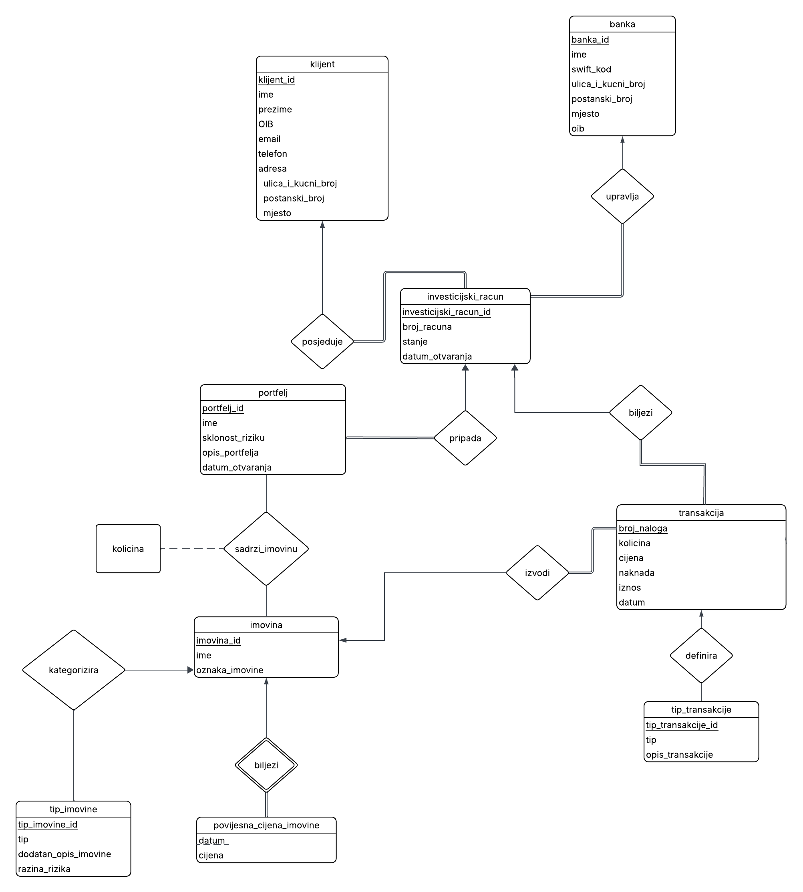
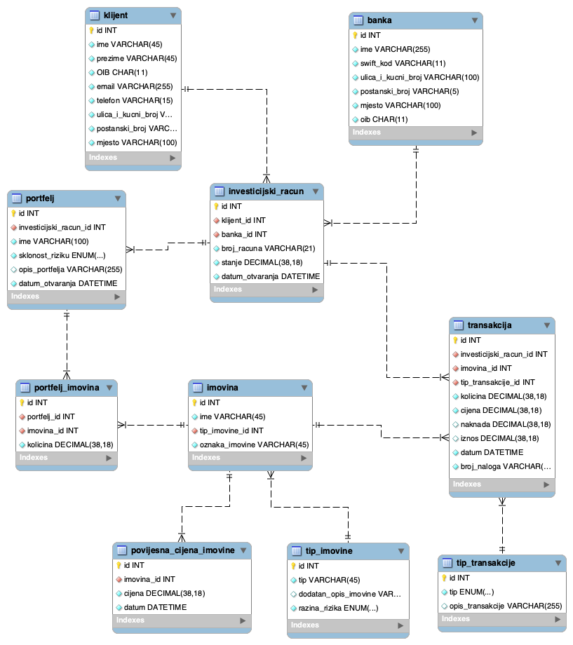

# DOKUMENTACIJA ZA PROJEKTNI ZADATAK "SUSTAV ZA UPRAVLJANJE INVESTICIJSKIM BANKARSTVOM"

## TIM 4

### Studenti: Luka Batarelo, Adrijan Drašćić, Vilibald Kovač, Matteo Lovrić, Benjamin Mihoci

#### 1. OPIS PROJEKTA

Sustav modelira proces investicijskog bankarstva za građane, omogućujući upravljanje korisnicima, njihovim investicijskim računima te ulaganjima u različite financijske instrumente. Sustav služi kao baza podataka za mobilnu aplikaciju koju svakodnevno koriste mali investitori odnosno građani.

Ova verzija sustava znatno je pojednostavljena radi prirode projekta, ali se iz iste mogu izvući relevatni podaci i način funkcioniranja samog sustava. Važno za naglasiti - sustav se fokusira na područje RH i samim time pretpostavlja isključivo iznose u eurima. Ovaj pojednostavljeni sustav nije predviđen da podržava druge valute.

Proces započinje registracijom klijenta u sustav, pri čemu se pohranjuju osnovni osobni podaci. Sami proces registracije i spremanja korisničkog imena i lozinke je preskočen da bismo zadržali projekt u potrebnim granicama.
Nakon registracije ili prijave u sustav, klijent može otvoriti jedan ili više investicijskih računa u odabranoj banci. Svaki investicijski račun pripada točno jednom klijentu i jednoj banci.

To bi značilo da unutar investicijskog računa klijent može kreirati jedan ili više portfelja koji predstavljaju skupove ulaganja.
Svaki portfelj može sadržavati više različitih vrsta imovine, poput dionica, fondova, indeksa, obveznica, kriptovaluta i slično. Odnos između portfelja i imovine je višestruk (M:N), što znači da jedan portfelj može sadržavati više vrsta imovine, a ista imovina može biti dio više portfelja različitih klijenata.

Uplata, isplata, kupnja i prodaja imovine te dividende i naknade evidentiraju se kroz transakcije koje su povezane s investicijskim računom i konkretnom imovinom. Svaka transakcija ima definirani tip (npr. kupnja, prodaja, uplata, isplata ili dividenda), količinu i cijenu, iznos te datum čime se omogućuje praćenje aktivnosti ulaganja.

Za svaku imovinu sustav bilježi povijest cijena kroz vrijeme, što omogućuje analizu kretanja vrijednosti portfelja i izračun prinosa.

Klasifikacija imovine i transakcija ostvarena je putem zasebnih pomoćnih (lookup) tablica, čime se osigurava konzistentnost i proširivost sustava.

Na taj način sustav omogućuje cjelovito praćenje investicijskog ciklusa - od unosa klijenta i upravljanja računima, preko ulaganja i transakcija, do analize tržišnih podataka i ostvarivanja prihoda.

#### 2. ER dijagram



#### 3. OPIS ER DIJAGRAMA

1. **klijent** i **investicijski_racun** su u vezi tipa **one-to-many (1:M)**. Jedan klijent može posjedovati više investicijskih računa, dok pojedini investicijski račun pripada točno jednom klijentu. Veza je sa strane investicijskog računa **potpuno uključena (totalna participacija)**, što znači da je pri unosu računa obavezno definirati pripadajućeg klijenta.
2. **banka** i **investicijski_racun** su u vezi tipa **one-to-many (1:M)**. Jedna banka može upravljati većim brojem investicijskih računa, dok pojedini investicijski račun pripada točno jednoj banci. Veza je sa strane investicijskog računa **potpuno uključena** jer svaki račun mora biti otvoren unutar jedne konkretne banke.
3. **investicijski_racun** i **uplata_isplata** su u vezi tipa **one-to-many (1:M)**. Na jednom investicijskom računu može se izvršiti više uplata ili isplata, dok se svaka pojedinačna uplata ili isplata odnosi na točno jedan investicijski račun. Svaki novčani promet mora biti evidentiran na točno određenom računu.
4. **investicijski_racun** i **portfelj** su u vezi tipa **one-to-many (1:M)**. Jedan investicijski račun može sadržavati više portfelja, dok pojedini portfelj pripada točno jednom investicijskom računu. Veza je sa strane portfelja **potpuno uključena** jer je portfelj nužno vezan za krovni investicijski račun.
5. **portfelj** i **imovina** su u vezi tipa **many-to-many (M:N)**. Jedan portfelj može sadržavati više različitih imovina, a ista imovina može biti dio više različitih portfelja. Budući da je riječ o **many-to-many** vezi, količina imovine unutar pojedinog portfelja modelirana je kao **opisni atribut** ove veze.
6. **tip_imovine** i **imovina** su u vezi tipa **one-to-many (1:M)**. Jedan tip imovine kategorizira više različitih imovina, dok pojedina imovina pripada točno jednom tipu imovine. Veza je sa strane imovine **potpuno uključena** jer svaka imovina mora biti klasificirana pod jedan definiran tip.
7. **imovina** i **povijesna_cijena_imovine** su u **identifikacijskoj vezi** tipa **one-to-many (1:M)**. Povijesna cijena je **slabi skup entiteta** čije postojanje egzistencijalno ovisi o jakom skupu entiteta imovina, a njezin parcijalni ključ (**diskriminator**) je predstavljen atributom datum. Slabi entitet podrazumijeva i potpunu uključenost.
8. **tip_transakcije** i **transakcija** su u vezi tipa **one-to-many (1:M)**. Jedan tip transakcije definira vrstu za više različitih transakcija, dok pojedina transakcija ima točno jedan definiran tip. Veza je sa strane transakcije **potpuno uključena** jer svaka transakcija mora imati određenu vrstu (npr. kupovina ili prodaja).
9. **imovina** i **transakcija** su u vezi tipa **one-to-many (1:M)**. Nad jednom imovinom može se izvršiti više različitih transakcija, dok se svaka pojedinačna transakcija odnosi na točno jednu imovinu. Veza je sa strane transakcije **potpuno uključena (totalna participacija)** jer se transakcija mora provesti nad konkretnom imovinom.
10. **investicijski_racun** i **transakcija** su u vezi tipa **one-to-many (1:M)**. Na jednom investicijskom računu može se izvršiti više transakcija, dok se svaka pojedinačna transakcija veže za točno jedan investicijski račun. Veza je sa strane transakcije **potpuno uključena** jer svaka transakcija mora teretiti ili odobravati točno određeni investicijski račun.

---

#### 4. RELACIJSKI MODEL (sheme)

U fazi relacijskog modeliranja uvodimo surogatne ključeve za sve entitete radi optimizacije performansi i lakše implementacije u SQL-u.
*(Napomena: **Podebljani** atributi su primarni ključevi, a *kosi* atributi su strani ključevi).*

* **klijent** (**klijent_id**, ime, prezime, OIB, email, telefon, ulica_i_kucni_broj, postanski_broj, mjesto)
* **banka** (**banka_id**, ime, swift_kod, ulica_i_kucni_broj, postanski_broj, mjesto, oib)
* **investicijski_racun** (**investicijski_racun_id**, *klijent_id*, *banka_id*, broj_racuna, stanje, datum_otvaranja)
* **portfelj** (**portfelj_id**, *investicijski_racun_id*, ime, datum_otvaranja, sklonost_riziku, opis_portfelja)
* **tip_imovine** (**tip_imovine_id**, tip, dodatan_opis_imovine, razina_rizika)
* **imovina** (**imovina_id**, ime, trenutna_cijena, *tip_imovine_id*, oznaka_imovine)
* **tip_transakcije** (**tip_transakcije_id**, tip, opis_transakcije)
* **transakcija** (**transakcija_id**, *investicijski_racun_id*, *imovina_id*, *tip_transakcije_id*, broj_naloga, kolicina, cijena, naknada, datum, iznos)
* **portfelj_imovina** (**portfelj_imovina_id**, *portfelj_id*, *imovina_id*, kolicina)
* **povijesna_cijena_imovine** (**povijesna_cijena_imovine_id**, *imovina_id*, cijena, datum)

#### 5. EER



#### 6. TABLICE

##### 6.1 TABLICA klijent

``` sql
CREATE TABLE klijent(
  id INT PRIMARY KEY AUTO_INCREMENT,
  ime VARCHAR(45) NOT NULL,
  prezime VARCHAR(45) NOT NULL,
  OIB CHAR(11) NOT NULL UNIQUE,
  email VARCHAR(255) NOT NULL UNIQUE,
  telefon VARCHAR(20) NOT NULL UNIQUE,
  ulica_i_kucni_broj VARCHAR(255) NOT NULL,
  postanski_broj CHAR(5) NOT NULL,
  mjesto VARCHAR(45) NOT NULL,
  CHECK (OIB REGEXP '^[0-9]{11}$'),
  CHECK (postanski_broj REGEXP '^[0-9]{5}$')
);
```

Tablica klijent služi za vođenje evidencije o klijentima koji u našem sustavu posjeduju investicijske račune.

Atribut **id** je PRIMARY KEY tipa INT s obzirom na to da je riječ o brojčanoj vrijednosti. Budući da je riječ o primarnom ključu UNIQUE i NOT NULL nije potrebno navoditi. AUTO_INCREMENT služi automatskom dodavanju jedinstvene brojčane vrijednosti prilikom unošenja novog retka u tablicu.

Atributi **ime** i **prezime** su tipa VARCHAR te ne očekujemo da će biti duži od 45 znakova. Ograničenje NOT NULL služi obveznom unosu tih podataka.

Atribut **OIB** osim što mora biti unesen (NOT NULL), mora biti i jedinstven (UNIQUE). Također, mora sadržavati točno 11 brojčanih znakova, što je zajamčeno CHECK-om i regularnim izrazima te samim tipom CHAR(11). Korištenje tipa INT ne bi imalo smisla zbog mogućih nula na početku broja. Također, OIB je ključ kandidat.

Atributi **email** i **telefon** također moraju biti uneseni i biti jedinstveni. VARCHAR se koristi za telefon iz istog razloga kao i za OIB (vodeće nule), ali i zbog mogućnosti upisivanja znakova poput '+' i '-'.

Atribut **ulica_i_kucni_broj** ne mora biti jedinstven (zbog mogućnosti da dva klijenta žive na istoj adresi) dok za **postanski_broj** CHECK-om ponovo jamčimo da će se raditi o točno pet znamenki.

Atribut **mjesto** mora biti unesen, ali ne mora biti UNIQUE jer se odnosi i na sela (a moguće je da se neka isto zovu).

##### 6.2. TABLICA banka

``` sql
CREATE TABLE banka(
  id INT PRIMARY KEY AUTO_INCREMENT,
  ime VARCHAR(255) NOT NULL UNIQUE,
  swift_kod VARCHAR(11) NOT NULL UNIQUE,
  oib CHAR(11) NOT NULL UNIQUE,
  ulica_i_kucni_broj VARCHAR(100) NOT NULL,
  postanski_broj VARCHAR(5) NOT NULL,
  mjesto VARCHAR(100),
  CHECK (OIB REGEXP '^[0-9]{11}$'),
  CHECK (postanski_broj REGEXP '^[0-9]{5}$'),
  CHECK (CHAR_LENGTH(swift_kod) IN (8, 11))
);
```

Ova tablica sadrži popis svih banaka koje upravljaju barem jednim investicijskim računom u našem sustavu.

Primarni ključ predstavljen je atributom **id**, a **ime** označava službeni naziv institucije koji mora biti unesen (NOT NULL). Budući da je ono jedinstveno (UNIQUE), predstavlja ključ-kandidat.

Atribut **swift_kod** je tipa VARCHAR jer sami swift kod banke može varirati između 8 i 11 znakova. Također, on je UNIQUE jer dvije banke ne bi smjele imati isti swift kod. CHECK-om se osigurava da je isti stvarno duljine između 8 i 11 znakova.

Slično kao i kod klijenta, atribut **oib** osim što mora biti unesen (NOT NULL), mora biti i jedinstven (UNIQUE). Također, mora sadržavati točno 11 brojčanih znakova, što je zajamčeno CHECK-om i regularnim izrazima te samim tipom CHAR(11). Korištenje tipa INT ne bi imalo smisla zbog mogućih nula na početku broja. Također, OIB je ključ kandidat.

Atribut **ulica_i_kucni_broj** ne mora biti jedinstven (zbog teoretske mogućnosti da dvije banke budu registrirane na istoj adresi na primjer u jednoj velikoj poslovnoj zgradi) dok za **postanski_broj** CHECK-om ponovo jamčimo da će se raditi o točno pet znamenki.

Atribut **mjesto** mora biti unesen, ali ne mora biti UNIQUE jer se odnosi i na sela (a moguće je da se neka isto zovu).

##### 6.3 TABLICA investicijski_racun

``` sql
CREATE TABLE investicijski_racun(
  id INT PRIMARY KEY AUTO_INCREMENT,
  klijent_id INT NOT NULL,
  banka_id INT NOT NULL,
  broj_racuna VARCHAR(21) NOT NULL UNIQUE,
  stanje DECIMAL(38,12) NOT NULL DEFAULT 0,
  datum_otvaranja DATETIME NOT NULL,
  FOREIGN KEY (klijent_id) REFERENCES klijent (id) ON DELETE CASCADE,
  FOREIGN KEY (banka_id) REFERENCES banka (id) ON DELETE RESTRICT,
  CHECK (broj_racuna REGEXP '^HR[0-9]{19}$')
);
```

Ova tablica predstavlja svojevrsnu polazišnu točku našeg sustava u kojemu se evidentiraju sredstva koja klijentima stoje na raspolaganju za ulaganje.

Atribut **id** je PRIMARY KEY tipa INT s obzirom na to da je riječ o brojčanoj vrijednosti. Budući da je riječ o primarnom ključu UNIQUE i NOT NULL nije potrebno navoditi. AUTO_INCREMENT služi automatskom dodavanju jedinstvene brojčane vrijednosti prilikom unošenja novog retka u tablicu.

**broj_racuna** se ovdje odnosi na IBAN, a CHECK-om i REGEX-om provjeravamo da počinje dvama slovima HR, nakon kojih slijedi 19 numeričkih znakova. Također, mora biti unesen (NOT NULL) i mora biti jedinstven (UNIQUE), zbog čega predstavlja ključ-kandidat.

**stanje** označava dostupna sredstva na pojedinom računu, a koristi tip podatka DECIMAL (koji je *fixed point* čime se izbjegavaju nepreciznosti *floating pointa* koji nije uputno koristiti za novac) s ukupno 38 znamenki, od kojih je 12 iza decimalne točke (što ostavlja 26 znamenki za cijeli dio iznosa). Dodano je ograničenje NOT NULL uz DEFAULT 0 jer svaki novi račun pri otvaranju inicijalno ima nula sredstava. [Budući da se naš hipotetski sustav odvija u Hrvatskoj i služi hrvatskim klijentima i bankama, pretpostavlja se da je riječ o eurima]

**datum_otvaranja** je tipa DATETIME, mora biti unesen (NOT NULL), a predstavlja datum i vrijeme stvaranja određenog investicijskog računa.

Strani ključevi **klijent_id** i **banka_id**, označeni ključnom riječi FOREIGN KEY, povezuju tablicu s tablicama "klijent" i "banka" preko tamošnjih atributa **id** što je određeno ključnom riječi REFERENCES.

ON DELETE CASCADE kod stranog ključa **klijent_id** jamči da će se prilikom brisanja pojedinog retka iz tablice "klijent", obrisati i odgovarajući retci u ovoj tablici.

ON DELETE RESTRICT kod stranog ključa **banka_id** pak će spriječiti brisanje retka iz tablice "banka" ako još uvijek postoje retci u ovoj tablici povezani s njima, odnosno ako još uvijek postoje računi kojima ta banka upravlja. ON DELETE RESTRICT je također defaultno ponašanje.

##### 6.4 TABLICA portfelj

``` sql
CREATE TABLE portfelj(
  id INT PRIMARY KEY AUTO_INCREMENT,
  investicijski_racun_id INT NOT NULL,
  ime VARCHAR(100) NOT NULL,
  sklonost_riziku ENUM('niska','srednja','visoka') NOT NULL,
  opis_portfelja VARCHAR(255),
  datum_otvaranja DATETIME NOT NULL,
  FOREIGN KEY (investicijski_racun_id) REFERENCES investicijski_racun (id) ON DELETE CASCADE,
  UNIQUE (investicijski_racun_id, ime) 
);
```

Tablica portfelj sadrži investicijske portfelje pojedinog investicijskog računa, a služi grupiranju različitih vrsta imovina. Ideja jest da se klijentima omogući posjedovanje više portfelja s različitim stopama rizika.

Atribut **id** je PRIMARY KEY tipa INT s obzirom na to da je riječ o brojčanoj vrijednosti. Budući da je riječ o primarnom ključu UNIQUE i NOT NULL nije potrebno navoditi. AUTO_INCREMENT služi automatskom dodavanju jedinstvene brojčane vrijednosti prilikom unošenja novog retka u tablicu.

**ime** portfelja mora biti uneseno (NOT NULL). Ne mora biti jedinstveno samo po sebi, ali mora biti jedinstveno unutar jednog investicijskog računa, što je zajamčeno ograničenjem UNIQUE (investicijski_racun_id, ime), pri čemu je **investicijski_racun_id** strani ključ koji tablicu povezuje s tablicom "investicijski_racun".

**investicijski_racun_id** predstavlja strani ključ koji tablicu povezuje s tablicom "investicijski_racun".

**sklonost_riziku** je ENUM vrijednost koja može poprimiti sljedeće vrijednosti: 'niska', 'srednja' ili 'visoka'. S obzirom da klijent može imati više portfelja, za svaki može odrediti sklonost riziku te si pojednostaviti izbor koja imovina treba pripadati u koji portfelj.

**opis_portfelja** je kratak opis čemu služi i koja je poanta pofrtelja. Taj atribut je tipa VARCHAR te je nullable jer ne mora svaki portfelj imati i opis.

**datum_otvaranja** odnosi se na datum stvaranja samog portfelja, a atribut je tipa DATETIME.

Ponovo, ON DELETE CASCADE će obrisati portfelj ako se obrisao investicijski račun kojemu pripada.

##### 6.5 TABLICA tip_imovine

``` sql
CREATE TABLE tip_imovine(
  id INT PRIMARY KEY AUTO_INCREMENT,
  tip VARCHAR(45) NOT NULL UNIQUE,
  dodatan_opis_imovine VARCHAR(255),
  razina_rizika ENUM('nizak', 'srednji', 'visok') NOT NULL
);
```

Ova tablica služi za reprezentaciju različitih vrsta imovine koje mogu biti dio pojedinog portfelja kao što su kriptovalute, dionice, itd.

Atribut **id** je PRIMARY KEY tipa INT s obzirom na to da je riječ o brojčanoj vrijednosti. Budući da je riječ o primarnom ključu UNIQUE i NOT NULL nije potrebno navoditi. AUTO_INCREMENT služi automatskom dodavanju jedinstvene brojčane vrijednosti prilikom unošenja novog retka u tablicu.

Atribut **tip** označava vrstu određene imovine te je ključ kandidat s obzirom na to da je jedinstven (UNIQUE). Također, mora biti unesen (NOT NULL).

**dodatan_opis_imovine** je VARCHAR vrijednost koja je NULLABLE, a služi dodatnom pojašnjenju same imovine unutar aplikacije.

**razina_rizika** je ENUM vrijednost koja može poprimiti sljedeće vrijednosti: 'nizak', 'srednji' ili 'visoki'. S obzirom da se imovina vrlo jednostavno može klasificirati kao više ili manje rizična, tome služi i ovaj atribut da klijentima pojednostavi razumijevanje samih imovinskih klasa.

##### 6.6 TABLICA imovina

``` sql
CREATE TABLE imovina(
  id INT PRIMARY KEY AUTO_INCREMENT,
  ime VARCHAR(45) NOT NULL UNIQUE,
  tip_imovine_id INT NOT NULL,
  oznaka_imovine VARCHAR(45) NOT NULL UNIQUE,
  FOREIGN KEY (tip_imovine_id) REFERENCES tip_imovine(id) ON DELETE RESTRICT
);
```

U ovoj su tablici sadržane sve instance imovina koje klijenti mogu posjedovati u sklopu svojih portfelja. Dakle, riječ je o konkretnom vlasništvu nad entitetima u stvarnom svijetu poput dionica tvrtke Apple.

Atribut **id** je PRIMARY KEY tipa INT s obzirom na to da je riječ o brojčanoj vrijednosti. Budući da je riječ o primarnom ključu UNIQUE i NOT NULL nije potrebno navoditi. AUTO_INCREMENT služi automatskom dodavanju jedinstvene brojčane vrijednosti prilikom unošenja novog retka u tablicu.

**ime** koristi tip VARCHAR te predstavlja jedinstveni naziv neke imovine dužine do 45 znakova i mora biti unesen i jedinstven (NOT NULL, UNIQUE). Atribut **trenutna_cijena** označava njezinu sadašnju tržišnu vrijednost. Kako ona nikada ne može biti manja od 0, koristi se ograničenje UNSIGNED. Isto tako, mora biti unesena (NOT NULL).

Atribut **oznaka_imovine** je tipa VARCHAR jer svaka imovina ima različite oznake tj. kratice po kojoj je ista prepoznatljiva na tržištu investicija. Ovaj atribut je ključ kandidat.

Također, **tip_imovine_id** predstavlja strani ključ iz tablice tip_imovine, odakle ga nije moguće obrisati dokle god postoji poveznica s njim u ovoj tablici.

##### 6.7 TABLICA tip_transakcije

``` sql
CREATE TABLE tip_transakcije(
  id INT PRIMARY KEY AUTO_INCREMENT,
  tip VARCHAR(45) NOT NULL UNIQUE,
  opis_transakcije VARCHAR(255)
);
```

Tablica koja služi kategorizaciji mogućih transkacija koje se izvršavaju nad različitim vrstama imovine (za razliku od tablice "uplata_isplata" koja se tiče isključivo novčanih sredstava koja utječu na stanje investicijskog računa).

Atribut **id** je PRIMARY KEY tipa INT s obzirom na to da je riječ o brojčanoj vrijednosti. Budući da je riječ o primarnom ključu UNIQUE i NOT NULL nije potrebno navoditi. AUTO_INCREMENT služi automatskom dodavanju jedinstvene brojčane vrijednosti prilikom unošenja novog retka u tablicu.

**tip** je ključ kandidat, koristi tip VARCHAR te ima na raspolaganju 45 znakova, a označava jedinstvenu (UNIQUE) vrstu transakcije poput "kupovina" ili "prodaja". Mora biti unesen (NOT NULL).

**opis_transakcije** je tipa VARCHAR i odnosi se na opcionalni opis samog tipa transakcije kako bi se korisnicima unutar aplikacije moglo pojasniti na što se odnosi koja transakcija.

##### 6.8 TABLICA transakcija

``` sql
CREATE TABLE transakcija(
  id INT PRIMARY KEY AUTO_INCREMENT,
  investicijski_racun_id INT NOT NULL,
  imovina_id INT NOT NULL,
  tip_transakcije_id INT NOT NULL,
  broj_naloga VARCHAR(45) NOT NULL UNIQUE,
  kolicina DECIMAL(38,18) UNSIGNED,
  cijena DECIMAL(38,18) UNSIGNED,
  naknada DECIMAL(38,18) UNSIGNED NOT NULL DEFAULT 2.00,
  datum DATETIME NOT NULL,
  iznos DECIMAL(38,18) UNSIGNED NOT NULL,
  FOREIGN KEY (investicijski_racun_id) REFERENCES investicijski_racun(id) ON DELETE CASCADE,
  FOREIGN KEY (imovina_id) REFERENCES imovina (id) ON DELETE RESTRICT,
  FOREIGN KEY (tip_transakcije_id) REFERENCES tip_transakcije (id) ON DELETE RESTRICT
);
```

Ova tablica vodi evidenciju o svim transakcijama nad imovinom unutar pojedinog investicijskog računa.
 
 Atribut **broj_naloga** (tipa VARCHAR) je ključ kandidat uz **UNIQUE** ograničenje koji služi korisničkoj strani za razlikovanje pojedinačnih transakcija.

Atributi **kolicina**, **cijena**, **iznos** i **naknada** koriste tip **DECIMAL(38,18)** s ograničenjem **UNSIGNED**. Visoka preciznost od 18 decimalnih mjesta nužna je za ispravno praćenje mikro-udjela (frakcijske dionice ili kriptovalute), dok `UNSIGNED` sprječava unos negativnih iznosa.

S razlogom su navedeni atributi **kolicina**, **cijena** i **iznos**. Atribut **iznos** odnosi se na tip transakcije uplata, isplata ili dividenda i u tom slučaju **kolicina** i **cijena** poprimaju `NULL` vrijednosti jer semantički nema smisla da imaju vrijednost. Za kupnju i prodaju **iznos** se izvodi iz atributa **kolicina** i **cijena** i samim time ima smisla da svi atributi imaju neku vrijednost tj. da nisu `NULL`.

Za atribut **naknada** specifično je definirano ograničenje **NOT NULL DEFAULT 0**. Time se svjesno izbjegavaju `NULL` vrijednosti u bazi, što pojednostavljuje pisanje kasnijih SQL upita i agregacijskih funkcija (poput `SUM`), jer ako je transakcija besplatna, naknada se automatski bilježi kao `0.00` umjesto kao nepoznata vrijednost. Naknada se računa kao postotak (1%) iznosa transakcije s time da ne može biti manja od 2,00 eura.

Atribut **datum** koristi tip **DATETIME** za bilježenje točnog vremena transakcije.

Strani ključevi povezuju transakciju s računom, imovinom i tipom transakcije. Pravilo **ON DELETE CASCADE** na računu osigurava brisanje transakcija ako se račun ugasi, dok **ON DELETE RESTRICT** na šifrarnicima sprječava brisanje imovine ili tipa transakcije ako na njih referencira postojeća transakcija.

##### 6.9 TABLICA portfelj_imovina

``` sql
CREATE TABLE portfelj_imovina(
  id INT PRIMARY KEY AUTO_INCREMENT,
  portfelj_id INT NOT NULL,
  imovina_id INT NOT NULL,
  kolicina DECIMAL(38,18) UNSIGNED NOT NULL,
  UNIQUE (portfelj_id, imovina_id),
  FOREIGN KEY (portfelj_id) REFERENCES portfelj (id) ON DELETE CASCADE,
  FOREIGN KEY (imovina_id) REFERENCES imovina (id) ON DELETE RESTRICT
);
```

Atribut **id** je PRIMARY KEY tipa INT s obzirom na to da je riječ o brojčanoj vrijednosti. Budući da je riječ o primarnom ključu UNIQUE i NOT NULL nije potrebno navoditi. AUTO_INCREMENT služi automatskom dodavanju jedinstvene brojčane vrijednosti prilikom unošenja novog retka u tablicu.

Ova tablica vodi evidenciju o tome koliko koji portfelj ima koje imovine, što se postiže stranim ključevima **portfelj_id** i **imovina_id** te atributom **kolicina**.

Pritom se ne može ista imovina više puta pojaviti u istom portfelju, što je zajamčeno ograničenjem UNIQUE (portfelj_id, imovina_id).

##### 6.11 TABLICA povijesna_cijena_imovine

``` sql
CREATE TABLE povijesna_cijena_imovine(
  id INT PRIMARY KEY AUTO_INCREMENT,
  imovina_id INT NOT NULL,
  cijena DECIMAL(38,18) UNSIGNED NOT NULL,
  datum DATETIME NOT NULL,
  FOREIGN KEY (imovina_id) REFERENCES imovina (id) ON DELETE CASCADE,
  UNIQUE (imovina_id, datum)
);
```

Na konceptualnoj razini (ERD), povijesna_cijena_imovine je slabi skup entiteta kojemu je **datum** parcijalni ključ (diskriminator). Međutim, prilikom prevođenja u relacijski model i SQL, uveli smo surogatni ključ **id** kao primarni ključ radi lakše implementacije. Međutim, nad kombinacijom atributa imovina_id i datum uveli smo UNIQUE ograničenje, čime se u praksi sprječava višestruki unos različitih cijena za istu imovinu u istom vremenskom trenutku.

Atribut **cijena** služi za evidentiranje cijene pojedine imovine u danom trenutku, koji je predstavljen atributom **datum**, a koji koristi tip DATETIME.
**cijena** koristi tip podatka DECIMAL s ukupno 38 znamenki, od kojih je 18 iza decimalne točke. Također, ona mora biti unesena (NOT NULL) i ne može biti negativna (UNSIGNED).

Strani ključ **imovina_id** povezuje tablicu s tablicom "imovina", odnosno povezuje određenu cijenu s pojedinom imovinom.
